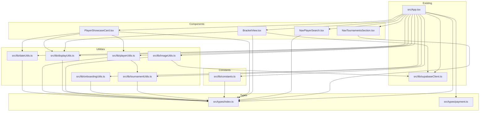

# Design Document: App.tsx Decomposition

## Overview

This design describes the incremental decomposition of `src/App.tsx` (~12,445 lines) into modular files. The monolith currently contains 14+ interfaces, 30+ helper functions, 4 inline sub-components, 70+ `useState` hooks, all Supabase queries, and the complete render logic.

The extraction follows a strict dependency order — types → utilities → constants → components — so that each step can be independently verified with `npm run build`. Functions that depend on React state or component-scoped variables remain in `App.tsx`.

**Design decisions:**
- No new dependencies. The project already has React 19, TypeScript 5.8, Vite 7, Tailwind CSS, and fast-check.
- The Supabase client is imported from the existing `src/lib/supabaseClient.ts` — never duplicated.
- Utility functions that currently reference `supabase` directly (like `avatarSrc`) will receive it as a parameter or import it from `src/lib/supabaseClient.ts`.
- Functions defined inside the `App` component body that reference state/hooks stay in `App.tsx`.

## Architecture

### Extraction Order

```
Phase 1: Types        → src/types/index.ts
Phase 2: Utilities    → src/lib/dateUtils.ts
                        src/lib/playerUtils.ts
                        src/lib/displayUtils.ts
                        src/lib/imageUtils.ts
                        src/lib/onboardingUtils.ts
                        src/lib/tournamentUtils.ts
Phase 3: Constants    → src/lib/constants.ts
Phase 4: Components   → src/components/PlayerShowcaseCard.tsx
                        src/components/BracketView.tsx
                        src/components/NavPlayerSearch.tsx
                        src/components/NavTournamentsSection.tsx
```

### Dependency Graph



### What Stays in App.tsx

Functions defined inside the `App` component body that reference React state, hooks, or component-scoped variables cannot be extracted without also extracting the state they depend on. These include:

- `getAvailabilityLabel`, `getPlayerAvailabilityMap`, `divisionRank`, `getStandingZone`, `hasDivisionZones` — reference component state
- `slotToTimes`, `parseDateSafe`, `hasActiveMatchWith` — defined inside App, reference local variables
- `buildCalendarData`, `downloadIcs`, `AddToCalendarButton` — reference `profiles`, `locations` state
- `setsForPlayer`, `gamesForPlayer`, `buildPlacementStandings`, `scoreLine` — reference component-scoped data
- `divisionIcon`, `tournamentLogoSrc` — defined inside App render scope, reference state indirectly
- `tituloFechaEs`, `isTodayOrFuture`, `parseYMDLocal`, `formatDateLocal`, `dateKey` — these are defined inside the App component body but are pure functions. They will be extracted to `src/lib/dateUtils.ts` by moving them outside the component scope.
- All 70+ `useState` hooks and their associated handlers
- All Supabase query functions (fetch, insert, update)
- The `BroadcastChannel` instance and auth sync logic
- The complete JSX render tree

## Components and Interfaces

### New Files

| File | Contents | Exports |
|------|----------|---------|
| `src/types/index.ts` | All shared interfaces and type aliases | `Profile`, `PlayerCard`, `HistoricPlayer`, `Location`, `AvailabilitySlot`, `Tournament`, `Division`, `Registration`, `Match`, `MatchSet`, `Standings`, `BookingAdmin`, `BookingAccount`, `CourtBookingRequest`, `SocialEvent`, `PendingOnboarding`, `PPCNotif`, `BookingVenueKey` |
| `src/lib/dateUtils.ts` | Date formatting and parsing functions | `formatISOToDDMMYYYY`, `parseDDMMYYYYToISO`, `tituloFechaEs`, `isTodayOrFuture`, `parseYMDLocal`, `formatDateLocal`, `dateKey` |
| `src/lib/playerUtils.ts` | Player statistics and league history | `getPlayerStatsSummaryAll`, `getLeagueRegistrationsForPlayer`, `getLastLeagueEntryForPlayer`, `getFirstLeagueEntryForPlayer`, `getPrettyLeagueResultForPlayer`, `getDivisionNameByIdLocal`, `getAgeFromBirthDate` |
| `src/lib/displayUtils.ts` | Text formatting and visual helpers | `toTitleCase`, `uiName`, `capitaliseFirst`, `divisionLogoSrc`, `divisionColors`, `divisionIcon`, `tournamentLogoSrc` |
| `src/lib/imageUtils.ts` | Image processing and avatar helpers | `dataURItoBlob`, `dataURLtoFile`, `resizeImage`, `avatarSrc`, `hasExplicitAvatar` |
| `src/lib/onboardingUtils.ts` | Onboarding persistence (sessionStorage/localStorage) | `compressAvailability`, `decompressAvailability`, `savePending`, `loadPending`, `clearPending`, `migrateLocalToSession` |
| `src/lib/tournamentUtils.ts` | Tournament classification helpers | `isCalibrationTournamentByName`, `isOfficialMatchByTournamentId` |
| `src/lib/constants.ts` | Application-wide constants | `BUSCAR_CLASES_ALLOWED_ID`, `PHOTOS_BASE_PATH`, `highlightPhotos`, `BOOKING_VENUES` |
| `src/components/PlayerShowcaseCard.tsx` | Player showcase card component | `PlayerShowcaseCard` (default or named export) |
| `src/components/BracketView.tsx` | Knockout bracket view + sub-components | `BracketView`, `BracketPlayerSlot`, `BracketMatchCard`, `getNextMatchPosition`, `advanceWinner` |
| `src/components/NavPlayerSearch.tsx` | Navigation player search component | `NavPlayerSearch` |
| `src/components/NavTournamentsSection.tsx` | Navigation tournaments section component | `NavTournamentsSection` |

### Existing Files (unchanged)

| File | Notes |
|------|-------|
| `src/types/payment.ts` | Preserved as-is. Not modified. |
| `src/lib/supabaseClient.ts` | Single source of Supabase client. Imported by `imageUtils.ts` and `BracketView.tsx`. |
| `src/lib/paymentUtils.ts` | Preserved as-is. |
| `src/hooks/usePaymentStatus.ts` | May need type imports from `src/types/index.ts` if it references types previously inferred from App.tsx props. |

### Cross-Module Dependencies

Key dependency: `playerUtils.ts` calls `isCalibrationTournamentByName` and `isOfficialMatchByTournamentId` from `tournamentUtils.ts`. This means `tournamentUtils.ts` must be extracted before or alongside `playerUtils.ts`.

Extraction strategy: extract `tournamentUtils.ts` first within the utilities phase, then `playerUtils.ts` can import from it.

### Supabase Client Handling

The `avatarSrc` function currently references the module-scoped `supabase` import directly. After extraction to `src/lib/imageUtils.ts`, it will import `supabase` from `src/lib/supabaseClient.ts`:

```typescript
// src/lib/imageUtils.ts
import { supabase } from './supabaseClient';
import type { Profile } from '../types';

export function avatarSrc(p?: Profile | null) {
  if (!p) return '/default-avatar.png';
  const direct = (p.avatar_url || '').trim();
  if (direct) return direct;
  const { data } = supabase.storage.from('avatars').getPublicUrl(`${p.id}.jpg`);
  return data?.publicUrl || '/default-avatar.png';
}
```

Similarly, `BracketView.tsx` will import `supabase` from `src/lib/supabaseClient.ts` for the `advanceWinner` function.

## Data Models

No new data models are introduced. All existing TypeScript interfaces and type aliases are moved as-is from `App.tsx` to `src/types/index.ts`. The interfaces map directly to the existing Supabase database schema.

### Type Inventory (moved to src/types/index.ts)

**Interfaces:**
- `Profile` — maps to `profiles` table
- `PlayerCard` — maps to `player_cards` table
- `HistoricPlayer` — maps to `historic_players` table
- `Location` — maps to `locations` table
- `AvailabilitySlot` — maps to `availability` table
- `Tournament` — maps to `tournaments` table
- `Division` — maps to `divisions` table
- `Registration` — maps to `tournament_registrations` table
- `Match` — maps to `matches` table
- `MatchSet` — maps to `match_sets` table
- `Standings` — computed standings view

**Type aliases:**
- `BookingAdmin` — maps to `booking_admins` table
- `BookingAccount` — maps to `booking_accounts` table
- `CourtBookingRequest` — maps to `court_booking_requests` table
- `SocialEvent` — maps to `social_events` table
- `PendingOnboarding` — local storage shape for onboarding flow
- `PPCNotif` — in-memory notification shape
- `BookingVenueKey` — union type for booking venue keys

## Correctness Properties

*A property is a characteristic or behavior that should hold true across all valid executions of a system — essentially, a formal statement about what the system should do. Properties serve as the bridge between human-readable specifications and machine-verifiable correctness guarantees.*

Most acceptance criteria in this feature are structural (file moves, import rewiring, build verification) and are best validated by smoke tests (`npm run build`). However, two acceptance criteria define round-trip properties on pure functions that are well-suited for property-based testing.

### Property 1: Availability compression round-trip

*For any* valid availability record (a mapping of day names to arrays of slot strings from the set `["Morning (07:00-12:00)", "Afternoon (12:00-18:00)", "Evening (18:00-22:00)"]`), compressing with `compressAvailability` then decompressing with `decompressAvailability` SHALL produce an equivalent availability record.

**Validates: Requirements 6.7**

### Property 2: Date parsing and formatting consistency

*For any* valid ISO date string in `YYYY-MM-DD` format (within the range 1900-01-01 to 2099-12-31), parsing with `parseYMDLocal` SHALL produce a valid `Date` object, and formatting that `Date` with `formatDateLocal` SHALL produce a non-empty Spanish-locale date string that contains the correct day number.

**Validates: Requirements 2.6**

## Error Handling

This refactor does not introduce new error handling. All existing error handling patterns (try/catch in onboarding storage, Supabase query error checks, image processing error callbacks) are preserved exactly as they are in the original `App.tsx`.

Key preservation points:
- `savePending` / `loadPending` / `clearPending` keep their try/catch wrappers for storage access
- `resizeImage` keeps its Promise reject path for canvas context failures
- `dataURItoBlob` / `dataURLtoFile` keep their existing behavior (no explicit error handling — they throw on malformed input, same as before)

## Testing Strategy

### Build Verification (Primary)

Every extraction step is verified by running `npm run build`. This is the primary correctness check — TypeScript compilation catches:
- Missing imports
- Type mismatches from incorrect extraction
- Circular dependencies (Vite/Rollup will error)
- Unused exports (with strict settings)

### Property-Based Tests

The project already has `fast-check` (v3.23.2) and `vitest` (v2.1.9) configured. Two property-based tests will be written:

1. **Availability round-trip** (`src/__tests__/onboardingUtils.test.ts`)
   - Generate random availability records using `fc.dictionary(fc.constantFrom('Mon','Tue','Wed','Thu','Fri','Sat','Sun'), fc.array(fc.constantFrom('Morning (07:00-12:00)','Afternoon (12:00-18:00)','Evening (18:00-22:00)'), {minLength: 1}))`
   - Verify `decompressAvailability(compressAvailability(input))` equals `input`
   - Minimum 100 iterations
   - Tag: **Feature: app-decomposition, Property 1: Availability compression round-trip**

2. **Date parsing consistency** (`src/__tests__/dateUtils.test.ts`)
   - Generate random valid dates using `fc.date({ min: new Date(1900,0,1), max: new Date(2099,11,31) })` converted to ISO strings
   - Verify `formatDateLocal(isoString)` via `parseYMDLocal` produces a non-empty string containing the correct day number
   - Minimum 100 iterations
   - Tag: **Feature: app-decomposition, Property 2: Date parsing and formatting consistency**

### Unit Tests (Example-Based)

Targeted unit tests for specific edge cases:
- `formatISOToDDMMYYYY` with null/undefined/empty input
- `parseDDMMYYYYToISO` with invalid dates (Feb 30, month 13)
- `isCalibrationTournamentByName` with various tournament name patterns
- `toTitleCase` with accented characters (Spanish names)
- `compressAvailability` with empty/null input

### Integration Verification

- Manual visual comparison of all views before and after refactor
- Verify `package.json` dependencies are unchanged
- Verify no new imports of external libraries
