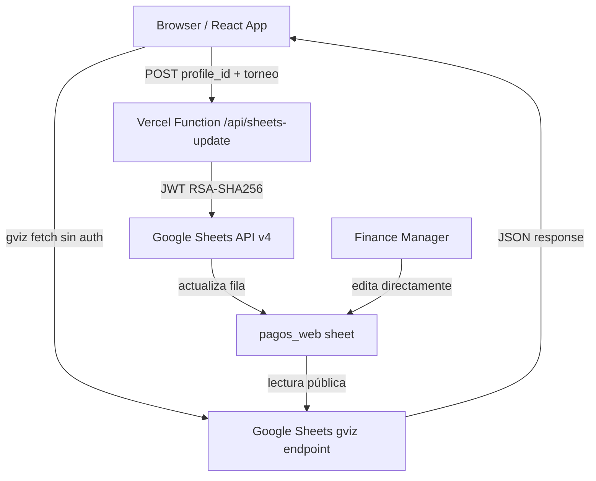

# Design Document: Fee Payment Tracking

## Overview

El sistema de seguimiento de cuotas (Fee Payment Tracking) añade una capa de visibilidad y autoreporte de pagos directamente en la Division_Table de la plataforma PPC Tennis. La fuente de verdad es la hoja `pagos_web` de Google Sheets, que se lee públicamente vía el endpoint gviz y se escribe de forma segura a través de una Vercel Function con Service Account.

El flujo cubre tres estados: `pendiente` → `pagado_sin_validar` → `pagado`. La transición del primer al segundo estado la realiza el jugador desde la plataforma; la del segundo al tercero la realiza el Finance Manager directamente en Google Sheets.

### Decisiones de diseño clave

- **Sin base de datos propia**: Google Sheets es la única fuente de verdad para el estado de pagos. Esto evita sincronización y mantiene el flujo de validación en una herramienta familiar para el Finance Manager.
- **Lectura pública, escritura protegida**: El endpoint gviz permite lectura sin credenciales. La escritura ocurre exclusivamente en el servidor (Vercel Function) usando la Service Account, nunca en el cliente.
- **Estado local optimista**: Tras un autoreporte exitoso, el estado local se actualiza inmediatamente sin esperar una nueva lectura del sheet, para una UX fluida.
- **Sin polling**: Los datos de pago se cargan una sola vez al montar la vista de división. El Finance Manager actualiza el sheet directamente; los cambios se reflejan en la próxima carga de la vista.

---

## Architecture



### Flujo de lectura

1. Al montar la vista de división, el frontend hace un `fetch` al endpoint gviz público.
2. La respuesta es un JSON envuelto en `google.visualization.Query.setResponse(...)` que se parsea con una regex.
3. Se construye un `Map<profile_id, PaymentStatus>` filtrando por el campo `torneo` del torneo activo.
4. El mapa se usa para renderizar los íconos en la Division_Table.

### Flujo de escritura

1. El jugador presiona "Ya pagué" → se abre el Payment_Modal.
2. El jugador confirma → el frontend hace `POST /api/sheets-update` con `{ profile_id, torneo }`.
3. La Vercel Function valida la solicitud, genera un JWT con la Service Account, y llama a la Google Sheets API v4 para actualizar la fila.
4. En caso de éxito, el frontend actualiza el estado local del jugador a `pagado_sin_validar`.

---

## Components and Interfaces

### Frontend

#### `usePaymentStatus` hook

```typescript
type PaymentStatus = 'pendiente' | 'pagado_sin_validar' | 'pagado';

type PaymentStatusMap = Map<string, PaymentStatus>;

interface UsePaymentStatusResult {
  paymentMap: PaymentStatusMap;
  loading: boolean;
  error: string | null;
  reportPayment: (profileId: string, torneo: string) => Promise<void>;
  reporting: boolean;
  reportError: string | null;
}

function usePaymentStatus(torneoName: string | null): UsePaymentStatusResult
```

Responsabilidades:
- Fetch al gviz endpoint al montar (cuando `torneoName` no es null).
- Parseo del JSON gviz y construcción del `PaymentStatusMap`.
- Filtrado por `torneo`.
- Exposición de `reportPayment` que llama a `/api/sheets-update`.
- Actualización optimista del estado local tras éxito.

#### `PaymentStatusIcon` component

```typescript
interface PaymentStatusIconProps {
  status: PaymentStatus | undefined;
}

function PaymentStatusIcon({ status }: PaymentStatusIconProps): JSX.Element | null
```

Renderiza:
- `💰` si `status === 'pendiente'`
- `✅` si `status === 'pagado_sin_validar'` o `status === 'pagado'`
- `null` si `status` es `undefined` (jugador sin registro)

#### `PaymentModal` component

```typescript
interface PaymentModalProps {
  isOpen: boolean;
  onConfirm: () => void;
  onCancel: () => void;
  isSubmitting: boolean;
  error: string | null;
}

function PaymentModal({ isOpen, onConfirm, onCancel, isSubmitting, error }: PaymentModalProps): JSX.Element | null
```

Muestra los datos bancarios hardcodeados y los botones "Sí, pagué" / "Cancelar".

#### Modificación de la Division_Table en `App.tsx`

La tabla de clasificación existente (líneas ~11750–11830 de `App.tsx`) se modifica para:
1. Añadir una columna `<th>` vacía (o con ícono de pago) a la izquierda de "Posición".
2. En cada `<tr>` de `rosterSorted.map(...)`, añadir una `<td>` con `<PaymentStatusIcon>` y, condicionalmente, el botón "Ya pagué".

### Backend (Vercel Function)

#### `api/sheets-update.ts`

```typescript
// Request body
interface UpdateRequest {
  profile_id: string;
  torneo: string;
}

// Response
// 200 OK: { success: true }
// 400 Bad Request: { error: string }
// 500 Internal Server Error: { error: string }
```

Responsabilidades:
1. Validar que `profile_id` y `torneo` están presentes en el body.
2. Leer `GOOGLE_SERVICE_ACCOUNT_JSON` del entorno; devolver 500 si no existe.
3. Generar JWT RSA-SHA256 con la Service Account (patrón ya validado en el proyecto).
4. Obtener access token de Google OAuth2.
5. Leer la hoja `pagos_web` para encontrar la fila con `profile_id` y `torneo` coincidentes.
6. Validar que el estado actual es `pendiente`; devolver 400 si no lo es.
7. Actualizar `estado = pagado_sin_validar` y `fecha_autoreporte = ISO 8601 timestamp`.
8. Devolver 200 en caso de éxito.

---

## Data Models

### Google Sheets — hoja `pagos_web`

| Columna | Tipo | Descripción |
|---------|------|-------------|
| `profile_id` | string | UUID del jugador en Supabase |
| `nombre` | string | Nombre del jugador (informativo) |
| `division` | string | Nombre de la división |
| `torneo` | string | Nombre del torneo (ej: "PPC Edición 5") |
| `estado` | string | `pendiente` \| `pagado_sin_validar` \| `pagado` |
| `fecha_autoreporte` | string | ISO 8601 timestamp del autoreporte |
| `fecha_validacion` | string | ISO 8601 timestamp de la validación por Finance Manager |

### Tipos TypeScript

```typescript
type PaymentStatus = 'pendiente' | 'pagado_sin_validar' | 'pagado';

// Mapa construido por el Sheets_Reader
type PaymentStatusMap = Map<string, PaymentStatus>;

// Fila parseada del gviz response
interface PagosWebRow {
  profile_id: string;
  nombre: string;
  division: string;
  torneo: string;
  estado: PaymentStatus;
  fecha_autoreporte: string | null;
  fecha_validacion: string | null;
}
```

### Parseo del gviz response

El endpoint gviz devuelve una respuesta con el formato:
```
/*O_o*/
google.visualization.Query.setResponse({...});
```

El JSON interno tiene la estructura:
```json
{
  "table": {
    "cols": [{ "label": "profile_id" }, ...],
    "rows": [{ "c": [{ "v": "uuid-..." }, ...] }]
  }
}
```

La función de parseo extrae el JSON con una regex, mapea columnas por índice (basado en el orden conocido de `pagos_web`), y construye un array de `PagosWebRow`.

---

## Correctness Properties

*A property is a characteristic or behavior that should hold true across all valid executions of a system — essentially, a formal statement about what the system should do. Properties serve as the bridge between human-readable specifications and machine-verifiable correctness guarantees.*

### Property 1: Filtrado de pagos por torneo

*For any* array de filas de `pagos_web` con valores variados en el campo `torneo`, al filtrar por un nombre de torneo específico, el mapa resultante SHALL contener únicamente las entradas cuyo campo `torneo` coincide exactamente con el nombre buscado.

**Validates: Requirements 1.2, 1.5**

### Property 2: Íconos de estado de pago son correctos y completos

*For any* lista de jugadores y cualquier `PaymentStatusMap`, la función de renderizado de íconos SHALL asignar `💰` a cada jugador con estado `pendiente`, `✅` a cada jugador con estado `pagado_sin_validar` o `pagado`, y ningún ícono a jugadores sin entrada en el mapa.

**Validates: Requirements 2.1, 2.2, 2.3**

### Property 3: El botón "Ya pagué" aparece como máximo una vez

*For any* lista de jugadores, cualquier `PaymentStatusMap`, y cualquier estado de autenticación, el número de botones "Ya pagué" renderizados en la tabla SHALL ser siempre 0 o 1 — nunca más de uno.

**Validates: Requirements 3.1, 3.4**

### Property 4: La Vercel Function solo permite la transición pendiente → pagado_sin_validar

*For any* fila en `pagos_web` con estado `pagado_sin_validar` o `pagado`, una solicitud de actualización para esa fila SHALL ser rechazada con HTTP 400. Solo las filas con estado `pendiente` pueden ser actualizadas.

**Validates: Requirements 6.4**

### Property 5: La Vercel Function valida la existencia del profile_id

*For any* `profile_id` que no existe en la hoja `pagos_web` para el `torneo` dado, la Vercel Function SHALL rechazar la solicitud con HTTP 400 sin realizar ninguna escritura.

**Validates: Requirements 6.3**

### Property 6: El lookup de fila es correcto para cualquier combinación profile_id + torneo

*For any* hoja `pagos_web` con múltiples filas, la función de búsqueda SHALL identificar correctamente la fila cuyo `profile_id` Y `torneo` coinciden con los valores buscados, sin confundir filas de distintos torneos para el mismo jugador.

**Validates: Requirements 5.6**

---

## Error Handling

### Errores de lectura (gviz fetch)

| Escenario | Comportamiento |
|-----------|----------------|
| Timeout o red caída | `paymentMap` queda vacío; la tabla se renderiza sin íconos de pago |
| Respuesta HTTP no-2xx | Igual que timeout |
| JSON malformado | Igual que timeout; se loguea el error en consola |
| Columnas en orden inesperado | El parseo falla silenciosamente; `paymentMap` queda vacío |

La Division_Table nunca bloquea su renderizado esperando los datos de pago. El estado de carga (`loading`) es independiente del estado de carga de la tabla principal.

### Errores de escritura (Vercel Function)

| Escenario | HTTP | Comportamiento en cliente |
|-----------|------|--------------------------|
| `profile_id` o `torneo` faltante | 400 | Mensaje de error en el modal |
| `profile_id` no encontrado en sheet | 400 | Mensaje de error en el modal |
| Estado no es `pendiente` | 400 | Mensaje de error en el modal |
| `GOOGLE_SERVICE_ACCOUNT_JSON` no configurado | 500 | Mensaje genérico de error |
| Error de Google Sheets API | 500 | Mensaje genérico de error |
| Error de red desde el cliente | — | Mensaje de error en el modal; estado local sin cambios |

En todos los casos de error, el estado local del jugador NO se actualiza y el botón "Ya pagué" permanece visible para que el jugador pueda reintentar.

### Doble envío

El botón "Sí, pagué" se deshabilita mientras la solicitud está en curso (`isSubmitting: true`), previniendo envíos duplicados.

---

## Testing Strategy

### Evaluación de PBT

Esta feature incluye lógica de transformación de datos (parseo del gviz response, filtrado por torneo, lookup de filas) y reglas de negocio (validación de transiciones de estado, unicidad del botón) que son adecuadas para property-based testing. Las operaciones de UI pura y las llamadas a servicios externos se cubren con tests de ejemplo e integración.

### Unit Tests (ejemplo-based)

- `PaymentModal` renderiza con los datos bancarios correctos
- `PaymentModal` llama `onCancel` al presionar "Cancelar" sin hacer fetch
- `PaymentModal` deshabilita "Sí, pagué" mientras `isSubmitting` es true
- `usePaymentStatus` actualiza el estado local a `pagado_sin_validar` tras respuesta exitosa
- `usePaymentStatus` muestra error y no cambia estado tras respuesta de error
- La Division_Table renderiza sin íconos cuando `paymentMap` está vacío (error de fetch)
- La Vercel Function devuelve 500 cuando `GOOGLE_SERVICE_ACCOUNT_JSON` no está configurado
- La Vercel Function devuelve 400 cuando el body no contiene `profile_id` o `torneo`

### Property-Based Tests

Se usará **fast-check** (compatible con Vitest/Jest, sin dependencias adicionales de runtime).

Cada test corre mínimo **100 iteraciones**.

**Tag format:** `// Feature: fee-payment-tracking, Property {N}: {property_text}`

#### Property 1: Filtrado de pagos por torneo
```typescript
// Feature: fee-payment-tracking, Property 1: filtrado por torneo
fc.property(
  fc.array(fc.record({ profile_id: fc.uuid(), torneo: fc.string(), estado: fc.constantFrom('pendiente','pagado_sin_validar','pagado') })),
  fc.string(),
  (rows, activeTorneo) => {
    const map = buildPaymentMap(rows, activeTorneo);
    // Todas las entradas del mapa deben venir de filas con torneo === activeTorneo
    for (const [profileId] of map) {
      const sourceRow = rows.find(r => r.profile_id === profileId && r.torneo === activeTorneo);
      expect(sourceRow).toBeDefined();
    }
    // Ninguna fila con torneo distinto debe aparecer en el mapa
    const otherRows = rows.filter(r => r.torneo !== activeTorneo);
    for (const row of otherRows) {
      // Solo puede estar en el mapa si también hay una fila con el mismo profile_id y el torneo correcto
      if (!rows.some(r => r.profile_id === row.profile_id && r.torneo === activeTorneo)) {
        expect(map.has(row.profile_id)).toBe(false);
      }
    }
  }
)
```

#### Property 2: Íconos de estado correctos
```typescript
// Feature: fee-payment-tracking, Property 2: íconos de estado de pago
fc.property(
  fc.array(fc.record({ profile_id: fc.uuid(), status: fc.option(fc.constantFrom('pendiente','pagado_sin_validar','pagado')) })),
  (players) => {
    const map = new Map(players.filter(p => p.status).map(p => [p.profile_id, p.status]));
    players.forEach(p => {
      const icon = getPaymentIcon(p.profile_id, map);
      if (p.status === 'pendiente') expect(icon).toBe('💰');
      else if (p.status === 'pagado_sin_validar' || p.status === 'pagado') expect(icon).toBe('✅');
      else expect(icon).toBeNull();
    });
  }
)
```

#### Property 3: Botón "Ya pagué" aparece como máximo una vez
```typescript
// Feature: fee-payment-tracking, Property 3: unicidad del botón Ya pagué
fc.property(
  fc.array(fc.uuid(), { minLength: 1, maxLength: 20 }),
  fc.option(fc.uuid()),
  fc.option(fc.constantFrom('pendiente','pagado_sin_validar','pagado')),
  (playerIds, currentUserId, currentUserStatus) => {
    const map = currentUserId && currentUserStatus
      ? new Map([[currentUserId, currentUserStatus]])
      : new Map();
    const buttonCount = countYaPaguéButtons(playerIds, currentUserId, map);
    expect(buttonCount).toBeLessThanOrEqual(1);
  }
)
```

#### Property 4: Solo transición pendiente → pagado_sin_validar
```typescript
// Feature: fee-payment-tracking, Property 4: transición de estado válida
fc.property(
  fc.constantFrom('pendiente', 'pagado_sin_validar', 'pagado'),
  (currentStatus) => {
    const result = validateStateTransition(currentStatus);
    if (currentStatus === 'pendiente') expect(result.allowed).toBe(true);
    else expect(result.allowed).toBe(false);
  }
)
```

#### Property 5: Validación de profile_id existente
```typescript
// Feature: fee-payment-tracking, Property 5: validación de profile_id
fc.property(
  fc.array(fc.record({ profile_id: fc.uuid(), torneo: fc.string() }), { minLength: 1 }),
  fc.uuid(),
  fc.string(),
  (rows, requestProfileId, requestTorneo) => {
    const exists = rows.some(r => r.profile_id === requestProfileId && r.torneo === requestTorneo);
    const result = validateProfileExists(rows, requestProfileId, requestTorneo);
    expect(result.valid).toBe(exists);
  }
)
```

#### Property 6: Lookup correcto por profile_id + torneo
```typescript
// Feature: fee-payment-tracking, Property 6: lookup de fila por profile_id y torneo
fc.property(
  fc.array(fc.record({ profile_id: fc.uuid(), torneo: fc.string(), estado: fc.constantFrom('pendiente','pagado_sin_validar','pagado') }), { minLength: 1 }),
  fc.integer({ min: 0 }),
  (rows, targetIndex) => {
    const target = rows[targetIndex % rows.length];
    const found = findRow(rows, target.profile_id, target.torneo);
    expect(found).toBeDefined();
    expect(found!.profile_id).toBe(target.profile_id);
    expect(found!.torneo).toBe(target.torneo);
  }
)
```

### Integration Tests

- Fetch real al gviz endpoint devuelve datos parseables (smoke test en CI con datos reales)
- La Vercel Function actualiza correctamente una fila en el sheet de staging (requiere entorno de test con sheet separado)

### Archivos de test sugeridos

```
ppc-final/src/__tests__/
  paymentStatus.test.ts      # Unit + property tests del hook y funciones puras
  paymentModal.test.tsx      # Unit tests del componente modal
  divisionTable.test.tsx     # Unit tests de la tabla con íconos de pago
ppc-final/api/__tests__/
  sheets-update.test.ts      # Unit + property tests de la Vercel Function
```
