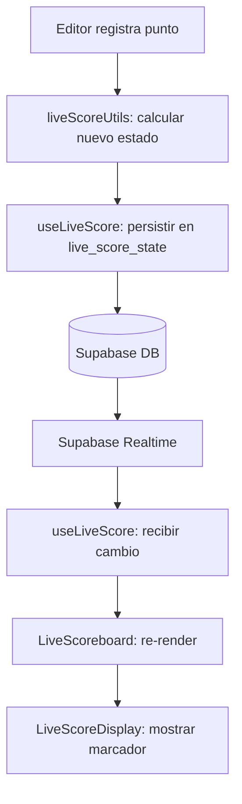
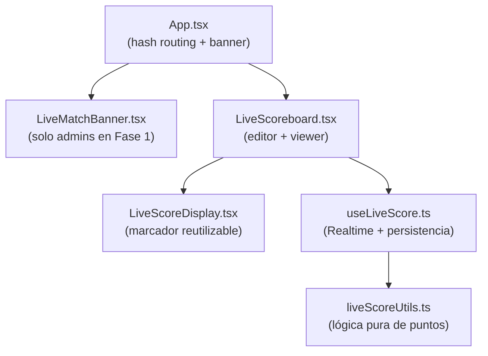

# Design Document: Live Scoreboard — PPC Tennis (Fase 1)

## Overview

El Live Scoreboard permite registrar y visualizar el marcador de un partido de tenis en tiempo real. Un Editor inicia el marcador desde un partido ya agendado en la plataforma PPC Tennis, y cualquier usuario autenticado puede seguirlo en vivo desde una URL compartible (`/#live/match/:id`).

El sistema se integra en la aplicación React existente sin React Router, usando hash routing para no romper la navegación por estado interno de `App.tsx`. El estado del marcador se persiste en Supabase (tabla `live_score_state`) y se propaga en tiempo real mediante Supabase Realtime. Al finalizar el partido, el resultado se guarda automáticamente en las tablas `matches` y `match_sets` existentes.

**Fase 1:** La feature es invisible en la navegación pública. Solo accesible vía URL directa. El Banner de partidos en vivo solo se muestra a usuarios con `role = 'admin'`.

### Formatos soportados

| Formato | Sets | Juegos/set | Ventaja | Tiebreak |
|---------|------|-----------|---------|----------|
| Standard | Mejor de 3 | 6 | Sí (Deuce/Ad) | 7 pts en 6-6 |
| NextGen | Mejor de 3 | 4 | No (punto de oro) | 7 pts en 4-4, punto de oro en 6-6 |
| Super Tiebreak | Mejor de 3 | 6 (sets 1-2) | Sí | 3er set = Super TB de 10 pts |

---

## Architecture

### Integración con App.tsx

La app existente usa navegación por estado interno. El Live Scoreboard se integra mediante:

1. **Hash routing**: `window.location.hash` se lee al montar la app y al cambiar (`hashchange` event).
2. **Render condicional**: Si el hash coincide con `/#live/match/:id`, se renderiza `LiveScoreboard` en lugar de la vista normal.
3. **Sin React Router**: No se introduce ninguna dependencia nueva de routing.

```
App.tsx
  ├── useEffect → escucha hashchange
  ├── if (hash matches /#live/match/:id) → render <LiveScoreboard matchId={id} />
  ├── else → render normal de la app
  └── <LiveMatchBanner /> (solo para admins en Fase 1)
```

### Flujo de datos



### Diagrama de componentes



---

## Components and Interfaces

### `liveScoreUtils.ts` — Lógica pura

Contiene todas las funciones puras de cálculo de puntuación. No tiene efectos secundarios ni dependencias de React.

```typescript
// Tipos principales
type MatchFormat = 'standard' | 'nextgen' | 'supertiebreak';

interface CompletedSet {
  p1: number;
  p2: number;
}

interface LiveScoreState {
  id: string;
  match_id: string;
  p1_sets: number;
  p2_sets: number;
  p1_games: number;
  p2_games: number;
  p1_points: number;   // 0=0, 1=15, 2=30, 3=40, 4=Ad (solo Standard)
  p2_points: number;
  server: 1 | 2;
  in_tiebreak: boolean;
  in_super_tiebreak: boolean;
  completed_sets: CompletedSet[];
  previous_state: Omit<LiveScoreState, 'previous_state'> | null;
  format: MatchFormat;
  best_of: number;
  editor_ids: string[];
  status: 'live' | 'finished';
  created_at: string;
  updated_at: string;
}

// Funciones exportadas
function addPoint(state: LiveScoreState, player: 1 | 2): LiveScoreState
function isEditor(userId: string, matchHomeId: string, matchAwayId: string,
                  userRole: string, editorIds: string[]): boolean
function formatPointScore(p1Points: number, p2Points: number,
                          inTiebreak: boolean, format: MatchFormat): string
function getServeAfterGame(currentServer: 1 | 2): 1 | 2
function getServeAfterTiebreakPoint(currentServer: 1 | 2, tiebreakPoints: number): 1 | 2
function initialState(matchId: string, format: MatchFormat, firstServer: 1 | 2): Omit<LiveScoreState, 'id' | 'created_at' | 'updated_at'>
```

#### Lógica de `addPoint`

`addPoint` es la función central. Recibe el estado actual y el jugador que ganó el punto, y devuelve el nuevo estado completo. Internamente:

1. Guarda `previous_state` = copia del estado actual (sin `previous_state` anidado).
2. Delega a la función de puntuación según `format` e `in_tiebreak`/`in_super_tiebreak`.
3. Si el jugador gana el juego → actualiza games, verifica si gana el set.
4. Si el jugador gana el set → actualiza sets, verifica si gana el partido.
5. Si el jugador gana el partido → marca `status = 'finished'`.
6. Actualiza `server` según las reglas de saque.

### `useLiveScore.ts` — Hook de estado y persistencia

```typescript
interface UseLiveScoreReturn {
  state: LiveScoreState | null;
  loading: boolean;
  error: string | null;
  connectionStatus: 'connected' | 'connecting' | 'disconnected';
  addPoint: (player: 1 | 2) => Promise<void>;
  undo: () => Promise<void>;
  addEditor: (userId: string) => Promise<void>;
  initMatch: (format: MatchFormat, firstServer: 1 | 2) => Promise<void>;
  finalizeMatch: () => Promise<void>;
}

function useLiveScore(matchId: string, currentUserId: string): UseLiveScoreReturn
```

Responsabilidades:
- Carga el estado inicial desde `live_score_state` al montar.
- Suscribe al canal Realtime `postgres_changes` en `live_score_state` filtrado por `match_id`.
- Expone `addPoint` que: calcula nuevo estado con `liveScoreUtils.addPoint`, persiste en Supabase, y si `status === 'finished'` llama a `finalizeMatch`.
- Expone `undo` que restaura `previous_state`.
- Gestiona reconexión automática del canal Realtime.
- Desuscribe al desmontar.

### `LiveScoreDisplay.tsx` — Display del marcador

Componente presentacional puro. Recibe el estado y los nombres de los jugadores y renderiza el marcador.

```typescript
interface LiveScoreDisplayProps {
  state: LiveScoreState;
  player1Name: string;
  player2Name: string;
  player1Avatar?: string;
  player2Avatar?: string;
  compact?: boolean;  // para el Banner
}
```

Muestra:
- Nombres de jugadores con indicador de saque (🎾 o bola animada).
- Sets completados (historial).
- Games del set actual.
- Puntuación del juego actual (0/15/30/40/Deuce/Ad o numérica en tiebreak).
- Estado de conexión Realtime.

### `LiveScoreboard.tsx` — Componente principal

Orquesta todo. Determina si el usuario es Editor o Viewer y renderiza los controles apropiados.

```typescript
interface LiveScoreboardProps {
  matchId: string;
  currentUser: User | null;
  currentProfile: Profile | null;
  onBack: () => void;
}
```

Responsabilidades:
- Carga datos del partido (`matches` + `profiles` de los jugadores).
- Usa `useLiveScore` para el estado en tiempo real.
- Determina rol del usuario (Editor/Viewer) con `isEditor`.
- Renderiza `LiveScoreDisplay` + controles de Editor si aplica.
- Maneja el flujo de inicio (selección de formato y primer sacador).
- Muestra mensaje de finalización con recordatorio de pintas/anécdota.
- Botón de compartir (copiar URL + WhatsApp).

### `LiveMatchBanner.tsx` — Banner global

```typescript
interface LiveMatchBannerProps {
  currentProfile: Profile | null;
}
```

- Solo visible para `role = 'admin'` en Fase 1.
- Suscribe a cambios en `matches` donde `status = 'live'` via Realtime.
- Muestra lista de partidos en vivo con enlace a cada uno.
- Se oculta automáticamente cuando no hay partidos en vivo.

---

## Data Models

### Nueva tabla: `live_score_state`

```sql
CREATE TABLE live_score_state (
  id                  uuid PRIMARY KEY DEFAULT gen_random_uuid(),
  match_id            uuid NOT NULL UNIQUE REFERENCES matches(id) ON DELETE CASCADE,
  p1_sets             int NOT NULL DEFAULT 0,
  p2_sets             int NOT NULL DEFAULT 0,
  p1_games            int NOT NULL DEFAULT 0,
  p2_games            int NOT NULL DEFAULT 0,
  p1_points           int NOT NULL DEFAULT 0,  -- 0/1/2/3/4 → 0/15/30/40/Ad
  p2_points           int NOT NULL DEFAULT 0,
  server              int NOT NULL DEFAULT 1,  -- 1=p1, 2=p2
  in_tiebreak         bool NOT NULL DEFAULT false,
  in_super_tiebreak   bool NOT NULL DEFAULT false,
  completed_sets      jsonb NOT NULL DEFAULT '[]',  -- [{p1:6,p2:4},...]
  previous_state      jsonb DEFAULT null,           -- snapshot para undo
  format              text NOT NULL DEFAULT 'standard',  -- 'standard'|'nextgen'|'supertiebreak'
  best_of             int NOT NULL DEFAULT 3,
  editor_ids          uuid[] NOT NULL DEFAULT '{}',
  status              text NOT NULL DEFAULT 'live',  -- 'live'|'finished'
  created_at          timestamptz NOT NULL DEFAULT now(),
  updated_at          timestamptz NOT NULL DEFAULT now()
);

-- Índice para Realtime y consultas por match
CREATE INDEX idx_live_score_state_match_id ON live_score_state(match_id);

-- Trigger para updated_at automático
CREATE OR REPLACE FUNCTION update_updated_at_column()
RETURNS TRIGGER AS $$
BEGIN NEW.updated_at = now(); RETURN NEW; END;
$$ language 'plpgsql';

CREATE TRIGGER update_live_score_state_updated_at
  BEFORE UPDATE ON live_score_state
  FOR EACH ROW EXECUTE FUNCTION update_updated_at_column();
```

### Modificación en `matches`

Añadir `'live'` como valor válido al campo `status` existente. No requiere cambio de tipo (ya es `text`). Solo actualizar la documentación y la lógica de la app.

```sql
-- No se necesita ALTER TABLE. El campo status ya es text.
-- Documentar los valores válidos: 'pending', 'scheduled', 'live', 'played', 'cancelled'
```

### RLS (Row Level Security)

```sql
-- Habilitar RLS
ALTER TABLE live_score_state ENABLE ROW LEVEL SECURITY;

-- Lectura: cualquier usuario autenticado puede leer
CREATE POLICY "live_score_state_select"
  ON live_score_state FOR SELECT
  TO authenticated
  USING (true);

-- Inserción: solo el creador del partido (home/away player) o admin
-- La validación de editor se hace en el cliente; el backend confía en auth.uid()
CREATE POLICY "live_score_state_insert"
  ON live_score_state FOR INSERT
  TO authenticated
  WITH CHECK (
    EXISTS (
      SELECT 1 FROM matches m
      WHERE m.id = match_id
        AND (m.home_player_id = auth.uid() OR m.away_player_id = auth.uid())
    )
    OR EXISTS (
      SELECT 1 FROM profiles p WHERE p.id = auth.uid() AND p.role = 'admin'
    )
  );

-- Actualización: jugadores del partido, admins, o editores adicionales
CREATE POLICY "live_score_state_update"
  ON live_score_state FOR UPDATE
  TO authenticated
  USING (
    EXISTS (
      SELECT 1 FROM matches m
      WHERE m.id = match_id
        AND (m.home_player_id = auth.uid() OR m.away_player_id = auth.uid())
    )
    OR EXISTS (
      SELECT 1 FROM profiles p WHERE p.id = auth.uid() AND p.role = 'admin'
    )
    OR auth.uid() = ANY(editor_ids)
  );
```

### Representación de puntos

| `p1_points` / `p2_points` | Display Standard | Display Tiebreak/SuperTB |
|--------------------------|-----------------|--------------------------|
| 0 | 0 | 0 |
| 1 | 15 | 1 |
| 2 | 30 | 2 |
| 3 | 40 | 3 |
| 4 | Ad (solo quien tiene ventaja) | 4... |

En Deuce: ambos tienen `p1_points = 3, p2_points = 3`. En Ad: el jugador con ventaja tiene `p = 4`, el otro `p = 3`.

### Estructura de `completed_sets`

```json
[
  { "p1": 6, "p2": 4 },
  { "p1": 7, "p2": 6 }
]
```

### Estructura de `previous_state`

Snapshot completo del estado antes del último punto, excluyendo `previous_state` para evitar anidamiento infinito:

```json
{
  "p1_sets": 0, "p2_sets": 0,
  "p1_games": 3, "p2_games": 2,
  "p1_points": 2, "p2_points": 1,
  "server": 1,
  "in_tiebreak": false,
  "in_super_tiebreak": false,
  "completed_sets": [],
  "format": "standard",
  "best_of": 3,
  "editor_ids": [],
  "status": "live"
}
```

---

## Correctness Properties

*A property is a characteristic or behavior that should hold true across all valid executions of a system — essentially, a formal statement about what the system should do. Properties serve as the bridge between human-readable specifications and machine-verifiable correctness guarantees.*

La lógica de puntuación en `liveScoreUtils.ts` es un conjunto de funciones puras con entradas y salidas bien definidas, lo que la hace ideal para property-based testing. Se usará **fast-check** (compatible con Vitest, ampliamente usado en proyectos TypeScript).

### Property 1: Undo es la inversa exacta de addPoint (1 nivel)

*Para cualquier* estado de partido válido y cualquier jugador (1 o 2), aplicar `addPoint` y luego restaurar `previous_state` del estado resultante debe producir un estado equivalente al original en todos los campos de marcador. Además, tras restaurar `previous_state`, el campo `previous_state` del estado restaurado debe ser `null`, garantizando que solo existe 1 nivel de undo.

**Validates: Requirements 4.5, 10.1, 10.3**

### Property 2: addPoint nunca decrece el marcador acumulado

*Para cualquier* estado de partido válido con `status = 'live'` y cualquier jugador (1 o 2), la suma total de `(p1_sets + p2_sets + p1_games + p2_games + p1_points + p2_points)` en el estado resultante de `addPoint` debe ser mayor o igual que en el estado original. El marcador nunca retrocede.

**Validates: Requirements 4.1, 4.2, 4.3**

### Property 3: El saque alterna correctamente entre juegos consecutivos

*Para cualquier* estado de partido válido fuera de tiebreak y super tiebreak, cuando se completa un juego (es decir, `addPoint` produce un estado con `p1_games + p2_games` mayor que el original), el campo `server` del nuevo estado debe ser el contrario al `server` del estado original.

**Validates: Requirements 8.2**

### Property 4: El saque en tiebreak y super tiebreak alterna cada 2 puntos

*Para cualquier* estado de tiebreak o super tiebreak válido, el jugador que saca en el punto N del tiebreak es determinado por: el primer sacador del tiebreak saca el punto 1, luego se alterna cada 2 puntos. Formalmente: si el total de puntos jugados en el tiebreak es `t`, el sacador es el primer sacador si `floor(t / 2)` es par, y el contrario si es impar.

**Validates: Requirements 8.3, 8.4**

### Property 5: La secuencia de puntos en Standard sigue 0→15→30→40→Deuce/Game

*Para cualquier* estado de juego en Standard_Format donde ningún jugador tiene ventaja (`p1_points < 3` o `p2_points < 3`, sin Deuce), aplicar `addPoint` para el jugador P debe incrementar `p_points` de P en exactamente 1, a menos que P ya tenga 3 puntos y el rival tenga menos de 3 (en cuyo caso P gana el juego y los puntos se reinician a 0-0). Cuando ambos llegan a 3, el estado es Deuce.

**Validates: Requirements 5.1, 5.2**

### Property 6: Deuce/Ad es un ciclo reversible

*Para cualquier* estado en Deuce (p1_points=3, p2_points=3) en Standard_Format, si el jugador A gana un punto (estado Ad: p_A=4, p_B=3) y luego el jugador B gana un punto, el estado resultante debe ser de nuevo Deuce (p1_points=3, p2_points=3). El ciclo Deuce→Ad→Deuce puede repetirse indefinidamente.

**Validates: Requirements 5.3, 5.4, 5.5**

### Property 7: El partido finaliza exactamente al alcanzar `ceil(best_of/2)` sets

*Para cualquier* estado de partido válido con `best_of = 3`, cuando un jugador alcanza 2 sets ganados como resultado de `addPoint`, el estado resultante debe tener `status = 'finished'`. Además, en ningún estado con `status = 'finished'` debe ser posible que `addPoint` produzca un estado diferente (el partido no continúa).

**Validates: Requirements 4.4, 9.1**

### Property 8: El tiebreak solo termina con 7+ puntos y diferencia ≥ 2 (Standard) o punto de oro en 6-6 (NextGen)

*Para cualquier* estado de tiebreak en Standard_Format, el tiebreak solo puede terminar (es decir, `in_tiebreak` pasa a `false`) cuando el ganador tiene al menos 7 puntos Y la diferencia entre los puntos de ambos jugadores es ≥ 2. En NextGen_Format, el tiebreak termina con 7+ puntos y diferencia ≥ 2, excepto cuando el marcador llega a 6-6, en cuyo caso el siguiente punto determina el ganador (punto de oro).

**Validates: Requirements 5.7, 6.4, 6.5**

### Property 9: El Super Tiebreak solo termina con 10+ puntos y diferencia ≥ 2

*Para cualquier* estado de Super_Tiebreak (`in_super_tiebreak = true`), el Super_Tiebreak solo puede terminar (es decir, `in_super_tiebreak` pasa a `false` y el partido finaliza) cuando el ganador tiene al menos 10 puntos Y la diferencia entre los puntos de ambos jugadores es ≥ 2.

**Validates: Requirements 7.2**

### Property 10: `initialState` siempre produce un estado válido y consistente

*Para cualquier* combinación válida de formato (`'standard'`, `'nextgen'`, `'supertiebreak'`) y primer sacador (`1` o `2`), `initialState` debe producir un estado donde: todos los contadores de puntos, juegos y sets son 0, `completed_sets` es un array vacío, `status = 'live'`, `previous_state = null`, `in_tiebreak = false`, `in_super_tiebreak = false`, y `server` coincide con el primer sacador especificado.

**Validates: Requirements 1.3, 14.3, 14.4**

### Property 11: `formatPointScore` es total y determinista sobre todos los estados válidos

*Para cualquier* combinación válida de `(p1_points, p2_points, in_tiebreak, in_super_tiebreak, format)` que pueda producir `addPoint` o `initialState`, `formatPointScore` debe devolver siempre una cadena no vacía y nunca lanzar una excepción. La misma entrada siempre produce la misma salida.

**Validates: Requirements 3.2, 5.1, 6.2**

### Property 12: NextGen nunca entra en estado Deuce

*Para cualquier* estado de partido en NextGen_Format, `addPoint` nunca debe producir un estado donde `p1_points = 3` y `p2_points = 3` simultáneamente sin que el juego haya terminado. En NextGen, cuando ambos jugadores llegan a 40 (p_points=3), el siguiente punto gana el juego directamente (punto de oro), sin pasar por Deuce ni Ad.

**Validates: Requirements 6.2, 6.3**

### Property 13: `isEditor` es correcto para todos los casos positivos y negativos

*Para cualquier* combinación de `(userId, homePlayerId, awayPlayerId, userRole, editorIds)`, `isEditor` debe devolver `true` si y solo si `userId === homePlayerId`, o `userId === awayPlayerId`, o `userRole === 'admin'`, o `editorIds.includes(userId)`. Para cualquier `userId` que no cumpla ninguna de estas condiciones, `isEditor` debe devolver `false`.

**Validates: Requirements 1.5, 1.6, 4.7, 11.3**

### Property 14: El display del marcador siempre contiene toda la información requerida

*Para cualquier* estado válido de `LiveScoreState` y cualquier par de nombres de jugadores no vacíos, el componente `LiveScoreDisplay` renderizado debe contener: el nombre de ambos jugadores, el marcador de games del set actual, el Point_Score del juego en curso (en formato legible), el historial de sets completados, y el indicador de saque junto al jugador correcto (`server`).

**Validates: Requirements 3.2, 3.3, 3.5, 8.1**

### Property 15: El tiebreak se activa en el momento correcto según el formato

*Para cualquier* estado de partido válido donde ambos jugadores tienen el mismo número de games igual al límite del formato (6 en Standard/SuperTiebreak, 4 en NextGen), el siguiente punto que complete ese juego debe producir un estado con `in_tiebreak = true`. Para SuperTiebreak_Format con sets en 1-1, el inicio del tercer set debe producir `in_super_tiebreak = true` en lugar de `in_tiebreak = true`.

**Validates: Requirements 5.6, 6.4, 7.1**

---

## Error Handling

### Errores de red / persistencia

| Situación | Comportamiento |
|-----------|---------------|
| Fallo al persistir un punto | Toast de error al Editor: "No se pudo guardar el punto. Inténtalo de nuevo." El estado local NO se actualiza (optimistic update desactivado). |
| Fallo al finalizar el partido | Toast de error: "Error al guardar el resultado final. Por favor, inténtalo de nuevo." El partido permanece en `status = 'live'`. |
| Fallo al iniciar el partido | Toast de error: "No se pudo iniciar el partido. Inténtalo de nuevo." |
| Fallo al añadir editor adicional | Toast de error silencioso (no bloquea la UI). |

### Errores de Realtime

| Situación | Comportamiento |
|-----------|---------------|
| Desconexión del canal Realtime | Indicador visual de estado ("Reconectando...") en el Scoreboard. |
| Reconexión exitosa | El indicador desaparece. Se recarga el estado desde DB para sincronizar. |
| Reconexión fallida tras N intentos | Mensaje: "Conexión perdida. Recarga la página para continuar." |

### Errores de acceso

| Situación | Comportamiento |
|-----------|---------------|
| `match_id` no existe | Mensaje: "Partido no encontrado." con botón para volver al inicio. |
| Partido ya finalizado (`status = 'played'`) | Muestra marcador final en modo solo lectura. |
| Usuario no autenticado | Redirige a login, guarda el hash en `sessionStorage` para redirect post-login. |
| Usuario sin permisos de Editor intenta registrar punto | El botón no existe en la UI (control solo visible para Editors). Si la petición llega igualmente (manipulación), RLS de Supabase la rechaza. |

### Estrategia de reconexión Realtime

```typescript
// En useLiveScore.ts
const MAX_RECONNECT_ATTEMPTS = 5;
const RECONNECT_DELAY_MS = 2000;

// Al detectar desconexión:
// 1. Marcar connectionStatus = 'connecting'
// 2. Esperar RECONNECT_DELAY_MS * attempt (backoff lineal)
// 3. Re-suscribir al canal
// 4. Al reconectar: recargar estado desde DB
// 5. Si falla MAX_RECONNECT_ATTEMPTS veces: connectionStatus = 'disconnected'
```

---

## Testing Strategy

### Enfoque dual

La estrategia combina **property-based tests** para la lógica pura de puntuación y **tests de ejemplo** para los componentes React y la integración con Supabase.

### Setup de testing

Se añadirá **Vitest** como test runner (compatible con Vite, sin configuración adicional) y **fast-check** para property-based testing:

```bash
npm install --save-dev vitest @vitest/ui fast-check
```

Configuración en `vite.config.ts`:
```typescript
/// <reference types="vitest" />
export default defineConfig({
  test: {
    globals: true,
    environment: 'node',  // liveScoreUtils es puro, no necesita DOM
  }
})
```

### Tests de propiedad (`liveScoreUtils.test.ts`)

Las 15 propiedades del diseño se implementan como tests de fast-check con mínimo **100 iteraciones** cada uno:

```typescript
// Ejemplo — Property 1: Undo es la inversa de addPoint
// Feature: live-scoreboard, Property 1: Undo es la inversa de addPoint
it('undo restores previous state and clears further undo', () => {
  fc.assert(
    fc.property(
      arbitraryLiveScoreState(),
      fc.constantFrom(1 as const, 2 as const),
      (state, player) => {
        const newState = addPoint(state, player);
        const restored = newState.previous_state!;
        // El estado restaurado debe ser equivalente al original
        expect(restored.p1_points).toBe(state.p1_points);
        expect(restored.p1_games).toBe(state.p1_games);
        expect(restored.p1_sets).toBe(state.p1_sets);
        expect(restored.server).toBe(state.server);
        // Tras el undo, no hay más undo disponible
        expect(restored.previous_state).toBeNull();
      }
    ),
    { numRuns: 100 }
  );
});
```

**Generadores arbitrarios** (`src/components/LiveScoreboard/__tests__/arbitraries.ts`):
- `arbitraryMatchFormat()` — genera `'standard' | 'nextgen' | 'supertiebreak'`
- `arbitraryLiveScoreState()` — genera estados válidos (puntos en rango, sets consistentes con `completed_sets`, `in_tiebreak` y `in_super_tiebreak` mutuamente excluyentes)
- `arbitraryTiebreakState()` — genera estados en tiebreak válidos con puntos numéricos
- `arbitraryDeuceState()` — genera estados en Deuce (p1_points=3, p2_points=3, Standard)
- `arbitraryIsEditorArgs()` — genera combinaciones de userId/homeId/awayId/role/editorIds

### Tests de ejemplo (componentes)

Para `LiveScoreboard.tsx`, `LiveScoreDisplay.tsx` y `LiveMatchBanner.tsx` se usan tests de ejemplo con **@testing-library/react**:

```bash
npm install --save-dev @testing-library/react @testing-library/user-event jsdom
```

Casos clave:
- Renderiza correctamente en modo Viewer (sin controles de Editor).
- Renderiza controles de Editor cuando el usuario es Editor.
- El botón Undo está deshabilitado cuando `previous_state = null`.
- El mensaje de finalización aparece cuando `status = 'finished'`.
- El indicador de saque apunta al jugador correcto.
- El botón de compartir copia la URL correcta.

### Tests de integración (Supabase)

Se usan con la Supabase local (CLI) o mocks:
- `useLiveScore` carga el estado inicial correctamente.
- `useLiveScore` actualiza el estado al recibir un evento Realtime.
- `finalizeMatch` escribe correctamente en `matches` y `match_sets`.
- RLS rechaza actualizaciones de usuarios no autorizados.

### Cobertura objetivo

| Módulo | Tipo de test | Cobertura objetivo |
|--------|-------------|-------------------|
| `liveScoreUtils.ts` | Property-based (fast-check) | >95% |
| `useLiveScore.ts` | Integración + mocks | >80% |
| `LiveScoreboard.tsx` | Ejemplo (@testing-library) | >70% |
| `LiveScoreDisplay.tsx` | Ejemplo (@testing-library) | >80% |
| `LiveMatchBanner.tsx` | Ejemplo (@testing-library) | >70% |
