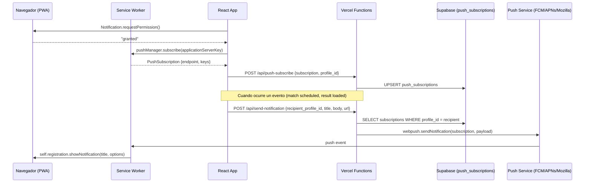

# Design Document: Push Notifications

## Overview

El sistema de notificaciones push para PPC Tennis permite enviar alertas nativas del navegador a los jugadores cuando ocurren eventos relevantes: un rival agenda un partido, se carga un resultado, o al día siguiente de un partido sin resultado registrado.

La arquitectura se basa en la **Web Push API con VAPID** (Voluntary Application Server Identification), usando el service worker existente (`public/sw.js`) como receptor de eventos push. Las suscripciones se almacenan en Supabase y el envío se realiza desde Vercel Functions usando la librería `web-push`.

### Flujo general



### Decisiones de diseño clave

1. **`web-push` npm package**: Librería estándar para envío de Web Push desde Node.js. Maneja VAPID signing, payload encryption, y comunicación con push services.
2. **Vercel Functions como backend**: Reutiliza la infraestructura existente (misma que `sheets-update.ts` y `telegram.ts`).
3. **Campo `reminder_sent` en `matches`**: Más simple que una tabla de log separada. Un booleano basta para evitar duplicados.
4. **Vercel Cron para recordatorios diarios**: Configuración declarativa en `vercel.json`, sin necesidad de infraestructura adicional.
5. **Hook `usePushNotifications`**: Encapsula toda la lógica de suscripción, permisos y opt-out en un solo hook reutilizable.

---

## Architecture

### Componentes del sistema

```mermaid
graph TD
    subgraph Frontend [React App]
        Hook[usePushNotifications hook]
        UI[Notification Banner/Toggle]
        Triggers[Event Triggers in App.tsx]
    end

    subgraph ServiceWorker [public/sw.js]
        PushHandler[push event handler]
        ClickHandler[notificationclick handler]
    end

    subgraph VercelFunctions [Vercel Functions]
        Subscribe[/api/push-subscribe]
        Send[/api/send-notification]
        Cron[/api/cron/daily-reminders]
    end

    subgraph Supabase [Supabase]
        SubsTable[(push_subscriptions)]
        MatchesTable[(matches)]
        ProfilesTable[(profiles)]
    end

    subgraph External [External Services]
        FCM[Firebase Cloud Messaging]
        APNs[Apple Push Notification service]
        Mozilla[Mozilla Push Service]
    end

    Hook --> Subscribe
    Hook --> UI
    Triggers --> Send
    Subscribe --> SubsTable
    Send --> SubsTable
    Send --> FCM
    Send --> APNs
    Send --> Mozilla
    Cron --> MatchesTable
    Cron --> Send
    FCM --> PushHandler
    APNs --> PushHandler
    Mozilla --> PushHandler
    PushHandler --> ClickHandler
```

### Flujo de datos por evento

| Evento | Trigger | Recipient | Contenido |
|--------|---------|-----------|-----------|
| Partido agendado | `handleScheduleMatch` / `handleAddMatch` en App.tsx | El otro jugador | Rival, fecha, hora, ubicación, link calendario |
| Resultado cargado | `handleSaveResult` en App.tsx | El otro jugador | Resultado set por set, ganador, link al partido |
| Recordatorio post-partido | Vercel Cron (diario) | Ambos jugadores | "¿Se jugó el partido?", nombre del rival, link |

---

## Components and Interfaces

### 1. `usePushNotifications` Hook

```typescript
// src/hooks/usePushNotifications.ts

interface UsePushNotificationsReturn {
  /** Whether the browser supports push notifications */
  isSupported: boolean;
  /** Current permission state: 'granted' | 'denied' | 'default' | 'loading' */
  permission: NotificationPermission | 'loading';
  /** Whether the user has an active subscription stored in DB */
  isSubscribed: boolean;
  /** Request permission and subscribe */
  subscribe: () => Promise<void>;
  /** Unsubscribe and remove from DB */
  unsubscribe: () => Promise<void>;
  /** Loading state during subscribe/unsubscribe operations */
  isLoading: boolean;
}

function usePushNotifications(profileId: string | null): UsePushNotificationsReturn;
```

### 2. `/api/push-subscribe` Vercel Function

```typescript
// api/push-subscribe.ts

// POST: Save or update a push subscription
interface PushSubscribeRequest {
  profile_id: string;
  subscription: {
    endpoint: string;
    keys: {
      p256dh: string;
      auth: string;
    };
  };
  user_agent: string;
}

// DELETE: Remove a subscription
interface PushUnsubscribeRequest {
  profile_id: string;
  endpoint: string;
}
```

### 3. `/api/send-notification` Vercel Function

```typescript
// api/send-notification.ts

interface SendNotificationRequest {
  recipient_profile_id: string;
  title: string;
  body: string;
  url: string;
  actions?: Array<{ action: string; title: string; url?: string }>;
}

interface SendNotificationResponse {
  success: boolean;
  sent: number;      // Number of subscriptions notified
  failed: number;    // Number of expired/invalid subscriptions cleaned up
}
```

### 4. `/api/cron/daily-reminders` Vercel Function

```typescript
// api/cron/daily-reminders.ts

// Triggered by Vercel Cron (no request body needed)
// Finds yesterday's unplayed matches and sends reminders
// Protected by CRON_SECRET header validation
```

### 5. Service Worker Push Handler

```typescript
// public/sw.js — push event

interface PushPayload {
  title: string;
  body: string;
  icon?: string;
  badge?: string;
  data: {
    url: string;
    actions?: Array<{ action: string; title: string; url?: string }>;
  };
}
```

### 6. Notification Trigger Utilities

```typescript
// src/lib/notificationUtils.ts

/** Build notification payload for a scheduled match */
function buildMatchScheduledPayload(
  match: Match,
  rivalName: string,
  locationName?: string
): { title: string; body: string; url: string; actions: Array<{action: string; title: string; url?: string}> };

/** Build notification payload for a result loaded */
function buildResultLoadedPayload(
  match: Match,
  sets: MatchSet[],
  rivalName: string,
  winnerId: string
): { title: string; body: string; url: string };

/** Build notification payload for a daily reminder */
function buildReminderPayload(
  match: Match,
  rivalName: string
): { title: string; body: string; url: string };

/** Generate Google Calendar URL for a match */
function buildCalendarUrl(
  rivalName: string,
  date: string,
  time?: string,
  location?: string
): string;
```

---

## Data Models

### New Table: `push_subscriptions`

| Campo | Tipo | Constraints | Descripción |
|-------|------|-------------|-------------|
| `id` | uuid | PK, default gen_random_uuid() | Identificador único |
| `profile_id` | uuid | FK → profiles, NOT NULL | Jugador dueño de la suscripción |
| `endpoint` | text | NOT NULL | URL del push service (FCM/APNs/Mozilla) |
| `p256dh_key` | text | NOT NULL | Clave pública del cliente (base64url) |
| `auth_key` | text | NOT NULL | Clave de autenticación (base64url) |
| `user_agent` | text | | User-Agent del navegador al suscribirse |
| `created_at` | timestamptz | default now() | Fecha de creación |
| `updated_at` | timestamptz | default now() | Última actualización |

**Constraints:**
- UNIQUE(`profile_id`, `endpoint`) — evita duplicados por dispositivo
- INDEX on `profile_id` — búsqueda rápida al enviar notificaciones

**RLS Policy:**
- SELECT: `auth.uid() = profile_id` (cada jugador solo ve sus suscripciones)
- INSERT: `auth.uid() = profile_id`
- DELETE: `auth.uid() = profile_id`
- Service role: acceso total (para Vercel Functions)

### Modified Table: `matches`

| Campo nuevo | Tipo | Default | Descripción |
|-------------|------|---------|-------------|
| `reminder_sent` | boolean | false | Si ya se envió el recordatorio post-partido |

---

### TypeScript Types (additions to `src/types/index.ts`)

```typescript
export interface PushSubscriptionRecord {
  id: string;
  profile_id: string;
  endpoint: string;
  p256dh_key: string;
  auth_key: string;
  user_agent: string | null;
  created_at: string;
  updated_at: string;
}

export interface NotificationPayload {
  title: string;
  body: string;
  url: string;
  actions?: Array<{ action: string; title: string; url?: string }>;
}
```

---


## Correctness Properties

*A property is a characteristic or behavior that should hold true across all valid executions of a system — essentially, a formal statement about what the system should do. Properties serve as the bridge between human-readable specifications and machine-verifiable correctness guarantees.*

### Property 1: Subscription upsert preserves uniqueness

*For any* push subscription data (profile_id, endpoint, keys), if a subscription with the same profile_id and endpoint already exists, upserting should result in exactly one record for that (profile_id, endpoint) pair with the latest keys and updated `updated_at` timestamp.

**Validates: Requirements 1.3**

### Property 2: Expired subscription cleanup

*For any* push subscription that returns HTTP 410 (Gone) or 404 when a notification is sent to it, the send-notification function should remove that subscription from the store and continue processing remaining subscriptions without error.

**Validates: Requirements 1.4, 8.4**

### Property 3: Correct recipient determination

*For any* match with both `home_player_id` and `away_player_id` assigned, and a given actor (the player who performed the action), the notification recipient should be the other player. Specifically:
- For "match scheduled": recipient = the player who did NOT schedule the match
- For "result loaded": recipient = the player whose ID ≠ `created_by`
- For a match transitioning from `away_player_id = null` to having an opponent: recipient = `home_player_id`

**Validates: Requirements 4.1, 4.4, 4.5, 5.1, 5.5**

### Property 4: Scheduled match payload completeness

*For any* match with a rival name, date, and optionally time and location, the generated "match scheduled" notification payload should contain: the rival's name in the body, the date, the time (if defined), and the location (if defined).

**Validates: Requirements 4.2**

### Property 5: Calendar URL generation

*For any* match where time is defined, the notification payload should include a valid Google Calendar URL containing the rival's name as title prefix, the correct date, start time, end time (start + 1 hour), and location. *For any* match where time is NOT defined, the calendar action should be omitted entirely.

**Validates: Requirements 4.3, 10.1, 10.2, 10.4**

### Property 6: No notification on metadata-only changes

*For any* match update where both `home_player_id` and `away_player_id` remain unchanged (only date, time, or location changed), the "match scheduled" notification trigger should return false (no notification sent).

**Validates: Requirements 4.6**

### Property 7: Result payload contains scores and winner

*For any* completed match with N sets of score data, the generated "result loaded" notification payload should contain all N set scores formatted as "X-Y" and correctly identify the winner based on sets won comparison.

**Validates: Requirements 5.2**

### Property 8: Reminder eligibility filter

*For any* set of matches with various dates, statuses, and player assignments, the reminder job filter should return exactly those matches where: `date` = yesterday AND `status` = 'scheduled' AND `away_player_id` IS NOT NULL AND `reminder_sent` = false.

**Validates: Requirements 6.2, 6.7**

### Property 9: Reminder sent to both players

*For any* match eligible for a reminder (passes the eligibility filter), the reminder job should generate notifications for both `home_player_id` and `away_player_id`.

**Validates: Requirements 6.3**

### Property 10: Reminder idempotence

*For any* match, running the reminder job twice should send the reminder at most once. After a successful send, `reminder_sent` is set to true and subsequent runs skip that match. If the send fails, `reminder_sent` remains false, allowing retry on the next run.

**Validates: Requirements 6.5, 11.2, 11.3, 11.4**

### Property 11: Push payload parsing

*For any* string received as a push event payload: if it is valid JSON with `title` and `body` fields, the service worker should show a notification with those exact values. If it is NOT valid JSON, the service worker should show a notification with title "PPC Tennis" and the raw string as body.

**Validates: Requirements 7.1, 7.2**

### Property 12: Send notification input validation

*For any* request to `/api/send-notification`, if any of the required fields (`recipient_profile_id`, `title`, `body`, `url`) is missing or empty, the function should return HTTP 400 without attempting to send.

**Validates: Requirements 8.2**

---

## Error Handling

### Frontend (usePushNotifications hook)

| Error | Handling |
|-------|----------|
| Browser doesn't support PushManager | `isSupported = false`, hide all notification UI |
| Permission denied by user | Set `permission = 'denied'`, show informational message, hide banner |
| Subscription API call fails | Show toast error, allow retry |
| Network error saving subscription to backend | Retry with exponential backoff (max 3 attempts), show error if all fail |

### Service Worker (sw.js)

| Error | Handling |
|-------|----------|
| Push payload is not valid JSON | Show generic notification with raw text as body |
| `showNotification` fails | Log error silently (no user-facing impact) |
| `clients.openWindow` fails | Fall back to `clients.matchAll` + `navigate` |
| No matching client window found | Open new window with the URL |

### Vercel Function: /api/send-notification

| Error | Handling | HTTP Status |
|-------|----------|-------------|
| Missing required fields | Return error message listing missing fields | 400 |
| Missing VAPID env vars | Return generic "Server configuration error" | 500 |
| Invalid/missing auth header | Return "Unauthorized" | 401 |
| No subscriptions found for profile | Return `{ success: true, sent: 0, failed: 0 }` | 200 |
| Subscription returns 410/404 | Delete subscription, continue with others | — |
| Subscription returns other error (5xx) | Log error, skip subscription, continue | — |
| All sends fail | Return `{ success: false, sent: 0, failed: N }` | 200 |

### Vercel Function: /api/push-subscribe

| Error | Handling | HTTP Status |
|-------|----------|-------------|
| Missing required fields | Return error | 400 |
| Invalid subscription format | Return error | 400 |
| Supabase insert/upsert fails | Return generic error | 500 |
| Profile not found | Return error | 404 |

### Vercel Function: /api/cron/daily-reminders

| Error | Handling | HTTP Status |
|-------|----------|-------------|
| Missing CRON_SECRET | Return "Unauthorized" | 401 |
| Invalid CRON_SECRET header | Return "Unauthorized" | 401 |
| Supabase query fails | Log error, return 500 | 500 |
| Individual notification send fails | Log error, do NOT mark reminder_sent, continue with next match | — |
| No eligible matches found | Return `{ success: true, reminders_sent: 0 }` | 200 |

---

## Testing Strategy

### Property-Based Tests (fast-check)

The project already uses `fast-check` (v3.23.2) with Vitest. Property tests will be written for the pure utility functions in `src/lib/notificationUtils.ts` and the filter/validation logic.

**Configuration:**
- Minimum 100 iterations per property test
- Each test tagged with: `Feature: push-notifications, Property {N}: {description}`

**Tests to implement:**

| Property | Function Under Test | Generator Strategy |
|----------|--------------------|--------------------|
| P1: Subscription upsert | Upsert logic (tested via integration) | Random subscription data |
| P3: Recipient determination | `determineRecipient(match, actorId)` | Random match objects with player IDs |
| P4: Payload completeness | `buildMatchScheduledPayload(...)` | Random match data (name, date, time?, location?) |
| P5: Calendar URL | `buildCalendarUrl(...)` | Random strings for name, dates, times, locations |
| P6: No notification on metadata change | `shouldNotifyMatchScheduled(oldMatch, newMatch)` | Random match pairs with same/different players |
| P7: Result payload | `buildResultLoadedPayload(...)` | Random match results with 2-5 sets |
| P8: Reminder filter | `filterEligibleMatches(matches, yesterday)` | Random arrays of matches with various dates/statuses |
| P10: Reminder idempotence | `filterEligibleMatches` with reminder_sent variations | Random matches with reminder_sent true/false |
| P11: Payload parsing | `parsePushPayload(rawString)` | Random strings (valid JSON and arbitrary text) |
| P12: Input validation | `validateSendNotificationRequest(body)` | Random objects with missing/present fields |

### Unit Tests (Vitest)

Example-based tests for:
- UI states of `usePushNotifications` hook (permission states, loading, error)
- Service worker event handlers (push, notificationclick)
- API endpoint authentication checks
- Edge cases: empty subscription list, all subscriptions expired

### Integration Tests

- Full subscribe flow: permission → subscribe → store in DB
- Full send flow: call API → query DB → send via web-push → handle responses
- Cron job: query matches → filter → send → mark reminder_sent

### Manual Testing

- Chrome Android: subscribe, receive notification, click to open app
- Safari iOS (PWA installed): subscribe, receive notification
- Permission denied flow
- Multiple devices for same user
- Notification while app is open vs closed

---

## Implementation Notes

### Dependencies to Add

```bash
npm install web-push  # For Vercel Functions (api/)
```

Note: `web-push` is only used server-side in Vercel Functions. It should NOT be bundled in the frontend.

### Environment Variables (Vercel)

```
VAPID_PUBLIC_KEY=<generated base64url public key>
VAPID_PRIVATE_KEY=<generated base64url private key>
VAPID_SUBJECT=mailto:ppctennis@example.com
CRON_SECRET=<random secret for cron job auth>
```

The VAPID public key also needs to be available to the frontend. Options:
- Hardcode in `src/lib/notificationUtils.ts` (it's a public key, safe to expose)
- Or use `VITE_VAPID_PUBLIC_KEY` env var

**Recommendation:** Use `VITE_VAPID_PUBLIC_KEY` for flexibility (can rotate without code change).

### vercel.json Configuration

```json
{
  "crons": [
    {
      "path": "/api/cron/daily-reminders",
      "schedule": "0 10 * * *"
    }
  ]
}
```

Note: Vercel Cron uses UTC. 10:00 UTC = 11:00 BST (summer) or 10:00 GMT (winter). This satisfies the "between 10:00 and 12:00 London time" requirement year-round.

### Authentication Strategy for /api/send-notification

Two callers need to authenticate:
1. **Frontend (after Supabase mutations):** Include the Supabase JWT in the Authorization header. The Vercel Function verifies it using the Supabase service role key.
2. **Cron job (/api/cron/daily-reminders):** Calls send-notification internally (same process), so no HTTP auth needed — it calls the send logic directly as a function import.

For simplicity, the send-notification endpoint will accept:
- `Authorization: Bearer <supabase_jwt>` — verified via Supabase auth
- OR `x-cron-secret: <CRON_SECRET>` — for internal cron calls (if needed as separate HTTP call)

### File Structure

```
ppc-final/
├── api/
│   ├── push-subscribe.ts          # POST/DELETE: manage subscriptions
│   ├── send-notification.ts       # POST: send push notification
│   ├── cron/
│   │   └── daily-reminders.ts     # Cron: daily reminder job
│   └── lib/
│       └── pushUtils.ts           # Shared: web-push setup, subscription queries
├── src/
│   ├── hooks/
│   │   └── usePushNotifications.ts  # React hook
│   ├── lib/
│   │   └── notificationUtils.ts    # Pure functions: payload builders, URL generators
│   └── types/
│       └── index.ts                 # Add PushSubscriptionRecord, NotificationPayload
├── public/
│   └── sw.js                        # Updated: push + notificationclick handlers
└── vercel.json                      # New: cron configuration
```
